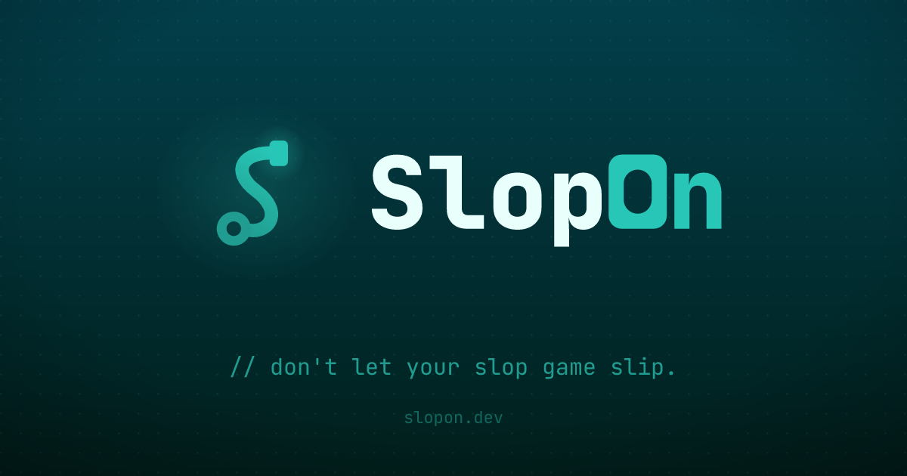

> [!IMPORTANT]
> This repository is currently a **placeholder** and does not host the project's
> source code. The source code will be made available in this repository once it
> reaches **10,000 stars** on GitHub.

## What is SlopOn?

SlopOn is a desktop agentic coding environment for building software with AI/LLMs. You attach one or more repositories to a project, configure one or more AI agents ("bots"), and chat with them to plan, generate, edit, run, and review code — with engineering process wrapped around the model: tasks, a phase pipeline, git worktrees, prompts, tool permissions, and human approval for anything sensitive.

Architecturally, SlopOn is a lightweight Flutter desktop client connected over WebSocket to a separate backend that performs the LLM calls, git operations, and tool execution. The backend can run locally on your machine or on a remote machine — the client works the same either way.

## Features

- **Human-in-the-Loop** — tool calls that need consent surface as approval prompts, agents can ask interactive questions mid-task, and per-project Tool Permissions decide what is auto-approved and what requires your sign-off.
- **Tasks & Phase Pipeline** — work is organized into tasks that move through an ordered pipeline of phases, each phase carrying a prompt-instruction template that generates a ready-to-run prompt.
- **Worktree** (per task) — each task can run in its own git worktree on an isolated branch, with diff-against-main review, merge to main, and teardown when done.
- **Context Compaction** — automatic or manual summarization of chat history when context usage crosses a configurable threshold, keeping long sessions coherent.
- **Session Token Stats** — a live context-usage indicator showing used vs. total tokens, with an input/output/cache breakdown.
- **Multiple repositories per project** — attach multiple Source Folders to a single project and work across them at once.
- **Multiple Bots per project** — configure several agents with different models, system prompts, and toolsets; Sub-Agent Orchestration lets a bot delegate scoped sub-tasks, and the Advisor Tool queries other LLMs for a second opinion.
- **No provider lock-in** — OpenAI-compatible and Anthropic API Providers with custom base URLs, including local, offline, and self-hosted models.
- **MCP Server support** — connect per-project Model Context Protocol servers over SSE or HTTP and make their tools available to your bots.
- **LSP Integration** — go-to-definition and find-references tools let agents navigate code semantically, the way an IDE does.
- **Prompt management** — reusable prompts with templates and quick prompts, each runnable with a chosen bot.
- **Remote backend support** — connect the desktop client to a backend running on another machine.
- **Lightweight, low-memory UI** — the client renders and orchestrates while the backend does the heavy work.
- **Native builds** for Windows, macOS, and Debian Linux.

## Installation & usage

1. Download the latest release for your platform (Windows x64, Linux x64, macOS x64, or macOS arm64) from the [releases page](https://github.com/DigiDecode/SlopOn.dev/releases).
2. Extract the archive — it contains the desktop app under `frontend/` and the self-hosted backend under `backend/`.
3. Follow the step-by-step installation instructions in [`docs/release-README.md`](docs/release-README.md): prerequisites (Node.js ≥ 20 and git), running the backend, and launching the app.

On first start, the backend generates an API key — enter that key in the app to connect. Then create a project, attach your source folders, and configure an API provider and one or more bots to start working.

## License

SlopOn is free for individuals and for organizations whose aggregate gross revenue is below USD 100,000 over the trailing 12 months; a commercial license is required above that threshold. Code and other output generated from your own inputs is yours. See [LICENSING.md](license/LICENSING.md) for the plain-language summary and [LICENSE.md](license/LICENSE.md) for the full terms.

## Development workspace

This repository still ships the `setup.sh` / `setup.bat` bootstrap scripts that clone and sync the project's development repositories — see [`docs/workspace-setup.md`](docs/workspace-setup.md).
