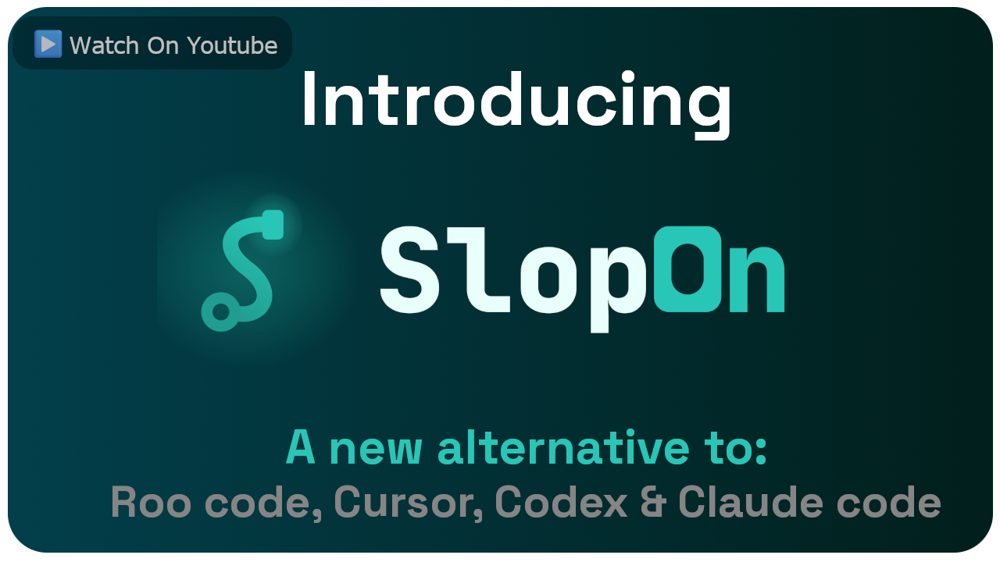

> [!IMPORTANT]
> The source code isn't here yet. It shows up once the project hits
> **10,000 stars**. The releases and installers below are the real product
> meanwhile.

[](https://youtu.be/nW0YdV7NyII)

## What is SlopOn?

A desktop agentic coding environment. You attach repos to a project, set up bots (agents), and chat with them to plan, write, run, and review code. The interesting part is the process around the model: tasks, a phase pipeline, one git worktree per task, prompt templates, tool permissions, and you signing off on anything sensitive before it happens.

It's a thin Flutter client talking to a separate backend over WebSocket. The backend does the LLM calls, git operations, and tool execution. Run it on your own machine or on some other box, the client doesn't care.

## Features

- Human in the loop. Tool calls that need consent turn into approval prompts, bots can ask you questions mid-task, and per-project tool permissions decide what's auto-approved and what waits for your click.
- Tasks and a phase pipeline. Each phase has a prompt template, so the prompt for the next step comes out ready to run (edit it first if you like).
- One git worktree per task: isolated branch, diff against main, merge when you're happy, tear it down when done.
- Context compaction. Chat history gets summarized (auto or manual) once usage crosses a threshold you set, so long sessions don't fall apart.
- Token stats: live used vs total context, with input/output/cache breakdown.
- Multiple source folders per project.
- Multiple bots per project, each with its own model, system prompt, and toolset. Bots can delegate scoped sub-tasks to other bots, and there's an advisor tool that asks another LLM for a second opinion.
- No provider lock-in. OpenAI-compatible and Anthropic providers, custom base URLs, local and self-hosted models all work.
- MCP servers over SSE or HTTP, per project, and their tools show up for your bots.
- LSP integration: go-to-definition and find-references, so bots navigate code like an IDE would.
- Reusable and quick prompts, each runnable with whichever bot you pick.
- Remote backend. Point the client at a backend running somewhere else.
- The client stays light on memory: it renders and orchestrates, the backend does the heavy lifting.
- Native builds for Windows, macOS, and Debian Linux.

## Install

Quickest way, one line, per-user, no admin:

macOS (Apple Silicon and Intel) and Debian Linux x64:

```sh
curl -fsSL https://slopon.dev/install.sh | sh
```

Windows x64 (Windows PowerShell):

```powershell
powershell -NoProfile -c "irm https://slopon.dev/install.ps1 | iex"
```

Afterwards launch SlopOn from your applications folder / Start Menu / app menu. Upgrading is running the same command again with SlopOn closed (app and backend). Your `~/.slopon` (config, database, attachments) stays put.

### Manual install

1. Get the archive for your platform from the [releases page](https://github.com/DigiDecode/SlopOn.dev/releases): `slopon-windows-x64.zip`, `slopon-linux-x64.tar.gz`, or `slopon-macos-arm64.zip` / `slopon-macos-x64.zip` (arm64 for Apple Silicon, x64 for Intel).
2. Extract it. You get three folders: `frontend/` (the desktop app), `backend/` (the Node.js server), `launcher/` (the one-command start helper).
3. Install backend dependencies from the shipped lockfile:

   ```sh
   cd backend
   npm ci
   ```

   Needs Node.js 20 or 22 (later majors aren't verified yet) and git on your PATH. On Linux, `chmod +x frontend/slopon_dev` if the binary lost its exec bit somewhere along the way.

4. Start it with the launcher: `./launcher/slopon.sh` on macOS/Linux, `launcher\slopon.cmd` on Windows. It boots the backend, waits until it's actually listening, then opens the app. Running it twice doesn't spawn a second backend. `--stop` brings the backend down again.

On first start the backend generates an API key and prints it in a banner. The app reads the same `~/.slopon/config.json`, so with the launcher you never type it. If you start the frontend yourself, the app asks for the key once.

The rest (logs under `~/.slopon/logs/`, the classic `node index.js` path, unsigned-build warnings) is in [`docs/release-README.md`](docs/release-README.md).

## License

Free for individuals and for orgs making less than USD 100,000 aggregate gross revenue (trailing 12 months). Above that, get a commercial license. Whatever the bots generate from your inputs is yours. Plain-language summary in [LICENSING.md](license/LICENSING.md), full terms in [LICENSE.md](license/LICENSE.md).

## Development workspace

The `setup.sh` / `setup.bat` scripts in this repo clone and sync the project's dev repositories. See [`docs/workspace-setup.md`](docs/workspace-setup.md) if you want to help out.
